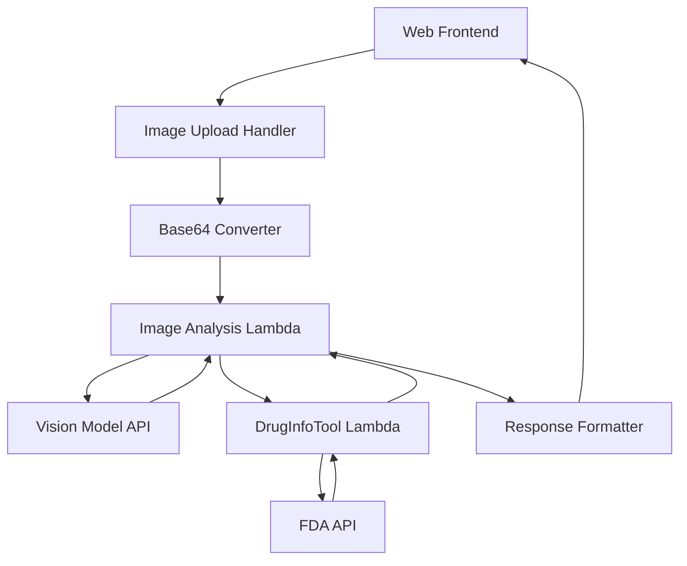

# Design Document

## Overview

The medication identification from image feature extends the existing CareCoach agent capabilities by adding computer vision functionality. The system will accept image uploads through a web interface, process them using a multimodal vision model to extract medication information, and automatically integrate with the existing DrugInfoTool to provide comprehensive drug information.

The design follows the existing lambda function architecture pattern and integrates seamlessly with the current Bedrock Agent framework.

## Architecture

### High-Level Architecture



### Component Flow

1. **Frontend Upload**: User uploads image via web interface
2. **Image Processing**: Convert to base64 and validate format/size
3. **Vision Analysis**: Send to multimodal model for medication identification
4. **Drug Information Retrieval**: Automatically call existing DrugInfoTool
5. **Response Synthesis**: Combine vision results with drug information
6. **User Display**: Present formatted results to user

## Components and Interfaces

### 1. Image Analysis Lambda Function

**Location**: `lambda_functions/image_analysis_tool/`

**Purpose**: Process uploaded images and extract medication information using vision models

**Key Functions**:
- `lambda_handler(event, context)`: Main entry point following Bedrock Agent pattern
- `process_image(base64_image, prompt)`: Send image to vision model
- `extract_medication_info(vision_response)`: Parse model response for drug name/dosage
- `call_drug_info_tool(drug_name)`: Integrate with existing DrugInfoTool
- `build_response(event, body)`: Format response for Bedrock Agent

**Input Format**:
```json
{
  "input": {
    "RequestBody": {
      "content": {
        "application/json": {
          "properties": [
            {
              "name": "image_data",
              "value": "base64_encoded_image_string"
            },
            {
              "name": "prompt",
              "value": "Identify the medication name and dosage in this image"
            }
          ]
        }
      }
    }
  }
}
```

**Output Format**:
```json
{
  "medication_name": "Advil",
  "dosage": "200mg",
  "confidence": 0.95,
  "drug_info": {
    "brand_name": "Advil",
    "generic_name": "Ibuprofen",
    "purpose": "Pain reliever/fever reducer",
    "warnings": "...",
    "indications_and_usage": "..."
  }
}
```

### 2. Web Frontend Interface

**Purpose**: Provide user-friendly image upload and result display

**Key Features**:
- Drag-and-drop image upload
- File browser selection
- Image preview
- Progress indicators
- Result display with formatted drug information
- Error handling and user feedback

**Supported Formats**: JPEG, PNG, WebP
**Size Limits**: Maximum 10MB per image

### 3. Vision Model Integration

**Model Selection**: AWS Bedrock Claude 3 Sonnet or similar multimodal model

**Prompt Strategy**:
```
Analyze this image of a medication. Extract the following information:
1. Medication name (brand name if visible, generic name if available)
2. Dosage strength (e.g., 200mg, 500mg)
3. Confidence level in identification

If multiple medications are visible, focus on the most prominent one.
If the image is unclear or no medication is identifiable, indicate this clearly.

Return the information in a structured format.
```

### 4. DrugInfoTool Integration

**Integration Method**: Direct function call within the same Lambda execution context

**Data Flow**:
1. Extract medication name from vision analysis
2. Format name for DrugInfoTool compatibility
3. Call existing `lambda_handler` function with proper event structure
4. Parse response and integrate with vision results

## Data Models

### ImageAnalysisRequest
```python
{
    "image_data": str,  # Base64 encoded image
    "prompt": str,      # Analysis prompt
    "max_file_size": int,  # Size limit in bytes
    "allowed_formats": List[str]  # Supported image formats
}
```

### MedicationIdentification
```python
{
    "medication_name": str,
    "dosage": str,
    "confidence": float,  # 0.0 to 1.0
    "alternative_names": List[str],
    "image_quality": str  # "good", "fair", "poor"
}
```

### CombinedResponse
```python
{
    "identification": MedicationIdentification,
    "drug_info": dict,  # From DrugInfoTool
    "processing_time": float,
    "success": bool,
    "error_message": str  # If applicable
}
```

## Error Handling

### Image Processing Errors
- **Invalid Format**: Return user-friendly message with supported formats
- **File Too Large**: Provide size limit information and compression suggestions
- **Corrupted Image**: Request user to re-upload
- **No Image Data**: Clear error message requesting valid image

### Vision Model Errors
- **API Timeout**: Implement retry logic with exponential backoff
- **Rate Limiting**: Queue requests and provide user feedback
- **Model Unavailable**: Fallback to alternative model or graceful degradation
- **Low Confidence**: Inform user and suggest retaking photo

### Drug Information Errors
- **Medication Not Found**: Provide helpful message and manual lookup suggestion
- **DrugInfoTool Failure**: Return identification results with note about missing drug info
- **API Errors**: Implement proper error propagation and user messaging

### Integration Patterns
```python
def handle_error(error_type, error_details, user_context):
    error_responses = {
        "image_processing": "Please check your image format and try again",
        "vision_analysis": "Unable to analyze image clearly. Please retake photo",
        "drug_lookup": "Medication identified but detailed info unavailable",
        "system_error": "Temporary system issue. Please try again"
    }
    
    return build_error_response(
        error_type=error_type,
        message=error_responses.get(error_type, "Unknown error"),
        details=error_details,
        suggestions=get_error_suggestions(error_type)
    )
```

## Testing Strategy

### Unit Testing
- **Image Processing**: Test base64 conversion, validation, format checking
- **Vision Integration**: Mock API responses, test parsing logic
- **DrugInfoTool Integration**: Test function calls and response handling
- **Error Handling**: Comprehensive error scenario coverage

### Integration Testing
- **End-to-End Flow**: Complete workflow from image upload to final response
- **DrugInfoTool Integration**: Verify proper data flow and response formatting
- **Error Scenarios**: Test all error conditions and recovery mechanisms

### Performance Testing
- **Image Processing Speed**: Measure conversion and validation times
- **Vision Model Latency**: Track API response times and optimize
- **Memory Usage**: Monitor Lambda memory consumption with large images
- **Concurrent Requests**: Test system behavior under load

### Test Data Requirements
- **Sample Images**: Collection of medication photos with known expected results
- **Edge Cases**: Blurry images, multiple medications, empty images
- **Format Variations**: Different image formats, sizes, and qualities
- **Known Medications**: Test cases with medications in DrugInfoTool database

### Automated Testing Pipeline
```python
test_cases = [
    {
        "name": "clear_single_medication",
        "image": "test_images/advil_clear.jpg",
        "expected_name": "Advil",
        "expected_dosage": "200mg",
        "min_confidence": 0.8
    },
    {
        "name": "blurry_image",
        "image": "test_images/medication_blurry.jpg",
        "expected_error": "low_confidence",
        "max_confidence": 0.5
    }
]
```

## Security Considerations

### Image Data Handling
- **Temporary Storage**: Images processed in memory only, no persistent storage
- **Data Sanitization**: Validate and sanitize all image data
- **Size Limits**: Enforce strict file size limits to prevent abuse
- **Format Validation**: Only accept whitelisted image formats

### API Security
- **Input Validation**: Comprehensive validation of all inputs
- **Rate Limiting**: Implement per-user rate limiting
- **Authentication**: Integrate with existing CareCoach authentication
- **Logging**: Secure logging without exposing sensitive data

### Privacy Protection
- **No Image Storage**: Images are processed and immediately discarded
- **Minimal Logging**: Log only essential information for debugging
- **Data Encryption**: Ensure all data transmission is encrypted
- **Compliance**: Maintain HIPAA compliance for healthcare data